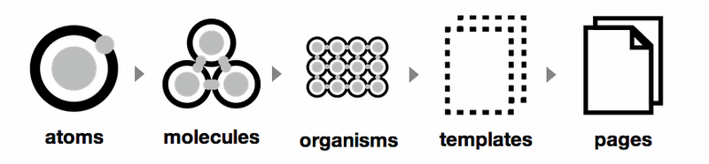

# Konvergo DOCS theme

This repository contains a [GROWI](https://github.com/weseek/growi) plugin for the Konvergo custom UI theme.

## Building

The theme is automatically linted and built before a commit using [Husky's git pre-commit](https://typicode.github.io/husky/).

## Structure

The structure is divided following a Sass atomic structure. This helps creating and maintaining components rules in many files, from the least complex element to a complete page.

Many articles and blogs refer to this type of architecture convention;

- [Atomic Design System Architecture with SCSS, ITCSS](https://gael-boyenval.gitbook.io/atomic-design-css-architecture-with-itcss-bem-sass/principles/atomic-design-system)
- [Atomic Design - Your Ultimate Guide to Scalable & Modular CSS (Sass)](https://blog.alexdevero.com/atomic-design-scalable-modular-css-sass/)

## Ressources

This plugin design is based off [GROWI's Vivid Internet plugin example](https://github.com/weseek/growi-plugin-theme-vivid-internet).

## Update checklist

- [ ] Upgrade `version` in `package.json`
- [ ] Check for upstream breaking changes
